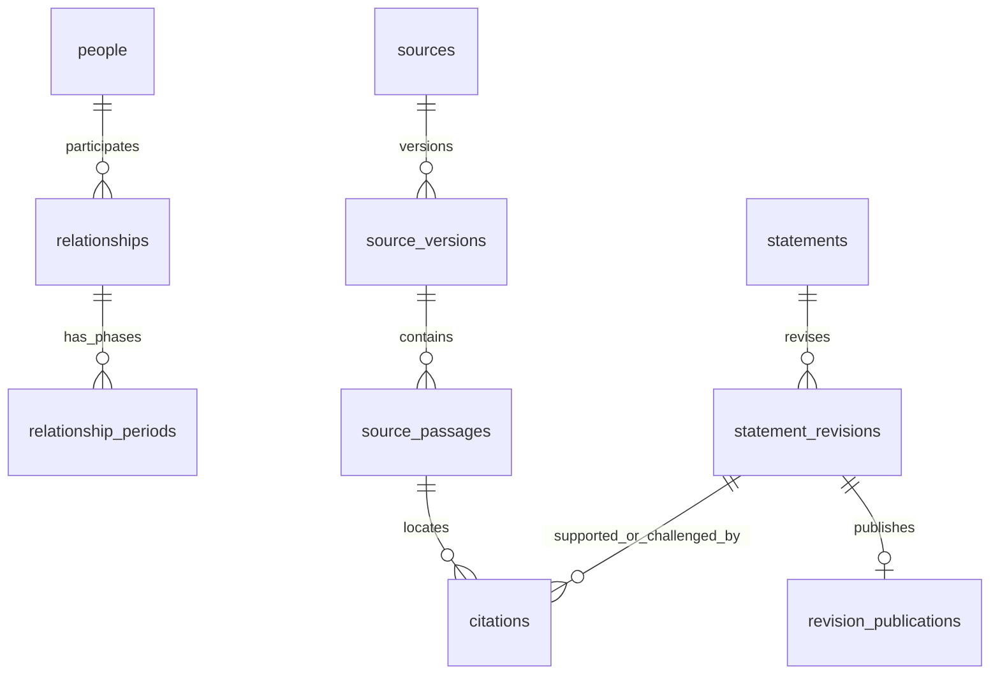

# 人物谱系数据库结构标准 · v9

生效日期：2026-09-23。适用于整个“鲁社长大老王宇宙”项目。

唯一工作数据库：`鲁社长/数据库/人物谱系.sqlite3`。`PRAGMA user_version=9`。
完整字段、约束、索引和触发器见 [schema_v9.sql](鲁社长/数据库/schema_v9.sql)；迁移见 [migrate_v9.py](scripts/migrate_v9.py)；入库操作见 [入库标准](入库标准.md)。旧 `schema_v7.sql` 和一次性导入脚本只供历史参考。

## 1. 身份、资料、来源分别保存

| 层 | 表 | 约定 |
|---|---|---|
| 人物 | `people`、`person_names`、`external_identifiers` | 稳定 ID，不用姓名作主键；允许同名，必填身份消歧说明；合并保留旧 ID 与记录 |
| 职业 | `classifications`、`person_classifications` | 一人多个职业标签；一个主标签控制头像色环，主标签必须存在于该人的标签中 |
| 履历 | `education`、`appointments` | 一条学习/任职经历一行；人物最高学历、最高职务只能引用自己的经历 |
| 机构与地区 | `organizations`、`positions`、`places` 及其 history 表 | 当前旧文本已转为实体引用；`label_only` 表示名称尚未消歧，不能假定同名即同机构 |
| 人际关系 | `relationships`、`relationship_periods`、`kinship_links` | 关系身份与阶段分别存储，父母/子女方向有明确角色；血亲与姻亲不混淆 |
| 圈层 | `factions`、`faction_memberships` | 独立于职业；成员关系带时间、主张者与来源；未知归属为 NULL |
| 事件 | `events`、`event_participants`、`person_events` | 事件可关联多人，人物状态须有单独的证据；共同参与事件不自动生成亲密关系 |
| 来源 | `sources`、`source_versions`、`source_passages`、`source_derivations` | 原始来源、元数据版本、具体片段、转载链分别保存 |
| 引用 | `citations` | 绑定到具体资料修订；支持、质疑、背景分别记录；多条转载不算多个独立来源 |
| 视频 | `video_analyses`、`video_segments`、`segment_people` | 先完成逐段原创 MD，再导入；保留秒数及人物索引；章节/片段/历史摘录明确区分 |
| 图片 | `assets` | SQLite 保存相对路径、来源、许可与使用状态；图片文件留在原头像目录 |
| 修订与审核 | `statements`、`statement_revisions`、`revision_publications`、`change_requests` 等 | 草稿不修改已发布资料，审核通过才更新当前投影 |
| 复核 | `person_review_results`、`review_findings`、`manuscript_reviews` | 保存逐人复核范围、问题清单、所用文稿文件与散列；问题未解决不假装核实 |

现行职业字典保留项目 v8 最新调整：**官员、军方、商业、媒体、学者、演员、主持人、运动员、律师、歌手、其他名人**。主分类与多标签外键一致。`f_pending` 仅作为兼容旧界面用的占位字典，人物不再通过它形成“待定派系”。

## 2. 每条资料都有修订身份

人物、教育、任职、关系、关系阶段、人物事件、信息线索、圈层归属、人物分类、视频分析、视频片段、圈层定义这 12 类记录受修订管理。

- `statements.id`：资料的稳定 ID；`entity_table/entity_id` 指向它对应的领域记录。
- `statement_revisions.id`：一次不可覆盖的修订。保存完整内容、版本号、上一版本、提交者、原因。
- `statements.current_revision_id`：当前公开采用的版本。
- 领域表的 `statement_id/revision_id`：供现有网页快速读取的当前版本投影。投影与修订必须完全一致，由发布事务同步；不是另一份可单独编辑的数据库。
- `citations.revision_id`：每次修订的依据。已发布版本不能再追加、更改或删除引用；补证据需要新修订。
- 回退是把旧内容作为新版本重新提交，不能删除中间历史。

`relationship_evidence`、旧状态文字与旧别名 JSON 为历史兼容数据。新关系来源展示读取 `current_relationship_evidence` 视图，从当前修订的 citations 生成；姓名 JSON 与 person_names 由发布器同步。新工作不能单独写这些副本。

## 3. 四个独立状态，不能互相替代

| 字段 | 可用值 | 用途 |
|---|---|---|
| `claim_kind` | record / self_report / reported_claim / opinion / prediction / mixed / unassessed | 记录、本人自述、转述、评论、预测、混合或未评估 |
| `verification_status` | supported / unverified / disputed / refuted / unassessed | 来源支持、未核、冲突、被否定或未评估 |
| `change_requests.state` | draft / submitted / needs_changes / approved / rejected / withdrawn | 投稿流程状态 |
| `statements.visibility` | public / review / private / hidden | 展示范围 |

`approved` 表示管理员准许按标注发布，不会把 `unverified` 自动变成 `supported`。投票只针对某个修订的“有帮助/需补证据”，不决定真假。一个用户在同一修订、同一维度只能有一票。

## 4. 时间轴使用实际有效时间

| 字段 | 含义 |
|---|---|
| `relationship_periods.valid_from/valid_to` | 该阶段发生/有效的时间；仅知年份存 `2015`，仅知月份存 `2015-11` |
| `start_precision/end_precision` | year / month / day / unknown，与日期内容一致 |
| `temporal_mode` | point 点状事件、interval 两端已知区间、start_only 只有起点、undated 未定年 |
| `end_state` | known 已知结束、unknown 未知结束、ongoing 有依据表明持续、not_applicable 点状记录无终点 |
| `observed_at` | 持续状态被观察/报道确认的截止日期；ongoing 必填 |
| `time_basis` | actual 实际时间、reported_occurrence 主张的发生时间、public_record_window 公开记录窗口、release_date 作品年份、unknown |
| `claim_series_id` | 同一来源解释链中的阶段序列；互相矛盾的说法分不同序列保留 |
| `relationship_state` | 该阶段的状态说明；不能仅靠“被调查”等事件猜测关系已破裂 |
| `strength/affinity/assessment_method` | 阶段强度、评价及评分理由；无依据为 NULL；不能从得票或类别自动计算 |

时间规则：

1. 区间按日包含起止边界。同一解释链的两个已知区间不能重叠；有冲突另建解释链，不覆盖。
2. 年/月表示日期不精确。图上只能表达该范围内“可能相关”，不能解释为明确从元旦开始任职或合作。
3. 一次合作用 point，之后不持续显示。`valid_to=NULL` 绝不自动等于“至今”。start_only 默认只显示起点范围；延伸部分须打开“未知时间”选项。
4. ongoing 仅显示到 observed_at；之后是资料未知。未知开关是扩大检索范围，不是补出事实。
5. “公开恋情日期”“作品发行年份”不冒充实际交往/拍摄起止日期。
6. 不同时间阶段的强度各自保存，不能拿人物关系总览的评分代替历史阶段评分。

其他履历使用原有 `start_date/end_date`，共享精度、终点状态、观察日期约定。调查、免职、退休、判刑、服刑、获释、死亡、遇害、执行死刑、移居和出逃是不同事件。未核实事件不得更新人物事实状态。

## 5. 时间轴与数据库历史是两条轴

- **有效时间**：上述实际事件/关系阶段时间。
- **报道时间**：`sources.published_at`、事件的 `reported_at`；不是事件发生时间。
- **资料收录时间**：`recorded_at`、修订 `created_at`、来源版本 `recorded_at`。
- **平台可见时间**：`revision_publications.published_at/retired_at`，回答“平台在某天采用哪一版本”。开始包含、退役时刻不包含。

历史版本查询使用：`published_at <= T AND (retired_at IS NULL OR T < retired_at)`。再按对应修订 JSON 中的实际时间筛选，才是“当时的平台所知”。现有网页仍为“以当前资料回看历史”，不宣称已经提供平台知识时间切换器。

此次迁移只能证明 v9 迁移时已存在这些资料，因此基线标为 `legacy_import`，发布时间取真实迁移时刻。不能伪造早年审核人或发布时间；既有收录日期原样保留。公开快照只保留当前投影，不充当完整历史备份。

## 6. 来源、媒体和公开边界

来源版本的 `metadata_sha256` 只校验元数据。没有保存原文的来源，`content_sha256` 留 NULL，不能用标题散列冒充全文存证。片段定位保存秒数或章节范围；原稿为摘要时不可标成逐字引文。

公开数据由 [public_columns.json](scripts/public_columns.json) 明确列出的表和字段生成，同时要求 public、当前版本、已发布。账号、权限、草稿、审核备注、选票、本地审计不导出。公开数据中的修订作者 ID、旧版本指针已脱敏/截断。隐藏人物的结构化关系依赖随之移除；隐藏结构化条目不会自动改写已公开文章全文，撤回文章需同时调整该来源/分析可见性。

头像元数据在 assets，`avatars/manifest.json` 是兼容导出，不能单独更新。现有图片再分发状态统一为 unreviewed，不因迁移获得新许可；公开仓库仍不包含这些照片。

## 7. 实现范围

本版是 SQLite 本地、可信维护者使用的结构及事务 API，不是已上线的公共账户系统。`publication_context` 是防误操作闸门，不是安全权限边界；拿到本地数据库写权限的人仍可修改数据库结构。正式开放公网时，认证、会话、防滥用、服务器权限隔离及 PostgreSQL 部署须另行实现，不能直接把本地 CLI 暴露给访客。
